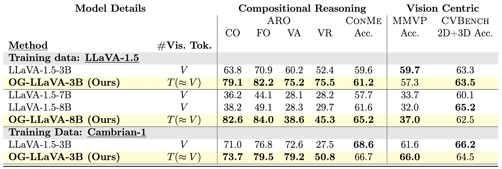
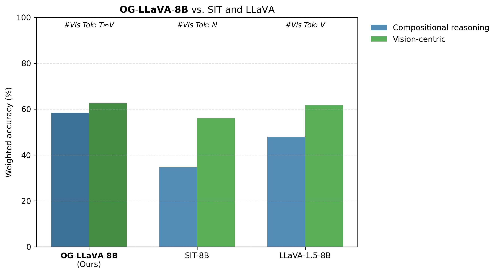

# Object-Guided Visual Tokens: Eliciting Compositional Reasoning in Multimodal Language Models

### M. Nulli, I. Najdenkoska, M. M. Derakhshani, M. Dorkenwald, Y. M. Asano

### Links: [Paper](paper/Long.pdf)

---
## Motivation and Main Process

Most Multimodal Large Language Models (MLLMs) use contrastively pre-trained vision encoders.  
They work well on many tasks, but often struggle when it comes to **compositional understanding** and **reasoning** about what’s actually in an image.  
That’s because these encoders are mainly trained for image–caption retrieval, not for truly breaking down and understanding all parts of a scene.  

Another issue is efficiency: state-of-the-art vision encoders generate **2–3x more visual tokens**, which slows down both training and inference.  

To tackle these problems, we introduce **OG-LLaVA (Object-Guided LLaVA)**.  
With our new connector design, **`OG-Fusion`**, the model can reason about visual content more effectively—without adding lots of extra tokens or fine-tuning the vision encoder itself.  

At the core of `OG-Fusion` is a simple but powerful idea: combine **CLIP representations** with **segmentation masks**.  
This lets OG-LLaVA leverage the descriptive strength of segmentation models to better capture **object relationships** and **spatial arrangements**.  

The result?  
**OG-LLaVA outperforms existing models on tasks that demand deeper visual reasoning and grounding**, all while staying efficient.

<table align="center">
  <tr align="center">
      <th></th>
  </tr>

  
  <tr align="left">
    <td colspan=2><a id='figure-1'><b>Figure 1: OG-LLaVA architecture with `OG-Fusion` internal process</b>.</td>
  </tr>
</table>

We extract visual features from the input image through a Vision Encoder.  
Concurrently, we pass the input image through `OG-Fusion`. Here we:  
1. Use a Segmentation model to retrieve the masks,  
2. Downsample the segmentations, and  
3. Apply these masks onto the visual features.  

These Visual Embeddings are then:  
4. Concatenated together and passed through a Multi-Layer Perceptron to produce Object-Guided Visual Tokens (**_OGVT_**).  

The **_OGVT_** are then given as input to a Large Language Model together with Textual Tokens to produce an output.  
The ❄️ (snowflake) and 🔥 (fire) represent modules whose parameters are kept **frozen** or **turned on**.  
LoRA emphasizes that not all parameters of the LLM are unfrozen, only the LoRA layers.

More information at [paper/Long.pdf](paper/Long.pdf).

## Visualizations

<table align="center">
  <tr align="center">
      <th></th>
  </tr>

  
  <tr align="left">
    <td colspan=2><a id='figure-1'><b>OG-LLaVA vs LLaVA-1.5 on ConMe Replace-Attribute examples.</b></td>
  </tr>
</table>
<table align="center">
  <tr align="center">
      <th></th>
  </tr>

  
  <tr align="left">
    <td colspan=2><a id='figure-1'><b>OG-LLaVA vs LLaVA-1.5 on MMVP examples.</b></td>
  </tr>
</table>
</table>
<table align="center">
  <tr align="center">
      <th></th>
  </tr>

  
  <tr align="left">
    <td colspan=2><a id='figure-1'><b>OG-LLaVA vs LLaVA-1.5 on ConMe Replace-Relation examples.</b></td>
  </tr>
</table>
<table align="center">
  <tr align="center">
      <th></th>
  </tr>

  
  <tr align="left">
    <td colspan=2><a id='figure-1'><b>OG-LLaVA vs LLaVA-1.5 on ConMe Replace-Object examples.</b></td>
  </tr>
</table>
<table align="center">
  <tr align="center">
      <th></th>
  </tr>

  
  <tr align="left">
    <td colspan=2><a id='figure-1'><b>OG-LLaVA vs LLaVA-1.5 on ConMe Replace-Relation examples.</b></td>
  </tr>
</table>

## Results
<table align="center">
  <tr align="center">
      <th></th>
  </tr>

  
  <tr align="left">
    <td colspan=2><a id='figure-1'><b>OG-LLaVA performance on Compositional Reasoning and Vision Centric tasks compared with LLaVA baselines.</b></td>
  </tr>
</table>

<table align="center">
  <tr align="center">
      <th></th>
  </tr>

  
  <tr align="left">
    <td colspan=2><a id='figure-1'><b>OG-LLaVA vs Subobject Level Image Tokenization and LLaVA-1.5 on Compositional Reasoning and Vision Centric tasks.</b></td>
  </tr>
</table>

## Training
Coming soon...

## Evaluation
Coming soon...

## Acknowledgments 

We would like to thank the following works that inspired this project:  
- [When and why vision-language models behave like bags-of-words, and what to do about it?](https://arxiv.org/abs/2210.01936)
- [In-Context Learning Improves Compositional Understanding of Vision-Language Models](https://arxiv.org/abs/2407.15487) 
- [ConMe: Rethinking Evaluation of Compositional Reasoning for Modern VLMs](https://arxiv.org/abs/2406.08164)   
- [Eyes Wide Shut? Exploring the Visual Shortcomings of Multimodal LLMs](https://arxiv.org/abs/2401.06209)
- [Cambrian-1: A Fully Open, Vision-Centric Exploration of Multimodal LLMs](https://arxiv.org/abs/2406.16860)  

 ## Citation

If you find our work useful for your research and applications, please consider citing us.