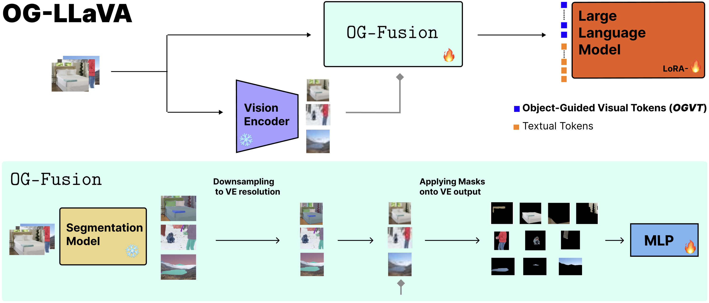
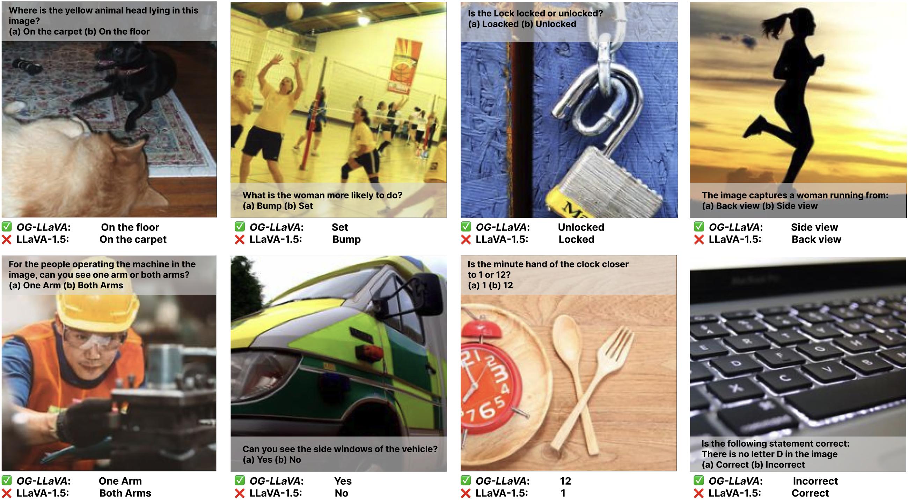
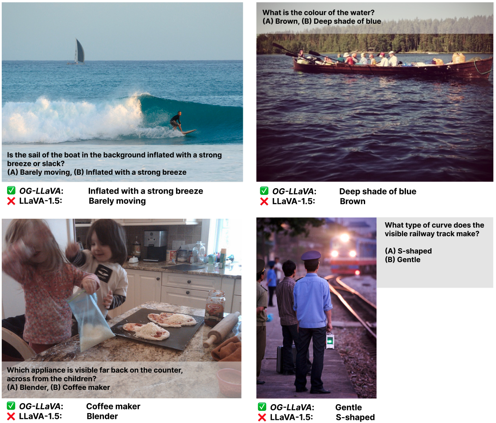
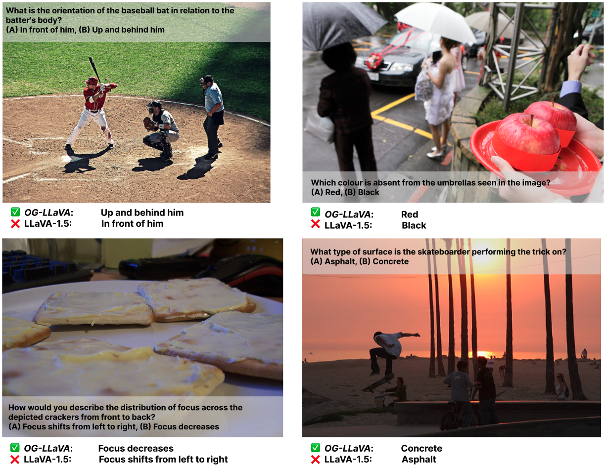

# Object-Guided Visual Tokens: Eliciting Compositional Reasoning in Multimodal Language Models

##### M. Nulli, I. Najdenkoska, M. M. Derakhshani, M. Dorkenwald, V. Orshulevich, Y. M. Asano

###### Links: 📄 [Paper](https://github.com/MatteoNulli/og_llava/blob/main/paper/LongPaper.pdf) | 📝 [Blogpost](https://matteonulli.github.io/blog/2025/ogllava/) | 🧑‍💻 [Code](https://github.com/MatteoNulli/og_llava/tree/main)
<br>

# Main Process

<table align="center">
  <tr align="center">
      <th></th>
  </tr>

  
  <tr align="left">
    <td colspan=2><a id='figure-1'><b>Figure 1: OG-LLaVA architecture with `OG-Fusion` internal process</b>.</td>
  </tr>
</table>

We extract visual features from the input image through a Vision Encoder.  
Concurrently, we pass the input image through `OG-Fusion`. Here we:  
1. Use a Segmentation model to retrieve the masks,  
2. Downsample the segmentations, and  
3. Apply these masks onto the visual features.  
4. Concatenated together and passed through a Multi-Layer Perceptron to produce Object-Guided Visual Tokens (**_OGVT_**).  

The **_OGVT_** are then given as input to a Large Language Model together with Textual Tokens to produce an output.  
The ❄️ (snowflake) and 🔥 (fire) represent modules whose parameters are kept **frozen** or **turned on**.  
LoRA emphasizes that not all parameters of the LLM are unfrozen, only the LoRA layers.


## Visualizations

<table align="center">
  <tr align="center">
      <th></th>
  </tr>

  
  <tr align="left">
    <td colspan=2><a id='figure-1'><b>OG-LLaVA vs LLaVA-1.5 on ConMe Replace-Attribute examples.</b></td>
  </tr>
</table>
<table align="center">
  <tr align="center">
      <th></th>
  </tr>

  
  <tr align="left">
    <td colspan=2><a id='figure-1'><b>OG-LLaVA vs LLaVA-1.5 on MMVP examples.</b></td>
  </tr>
</table>
</table>
<table align="center">
  <tr align="center">
      <th></th>
  </tr>

  
  <tr align="left">
    <td colspan=2><a id='figure-1'><b>OG-LLaVA vs LLaVA-1.5 on ConMe Replace-Relation examples.</b></td>
  </tr>
</table>
<table align="center">
  <tr align="center">
      <th></th>
  </tr>

  
  <tr align="left">
    <td colspan=2><a id='figure-1'><b>OG-LLaVA vs LLaVA-1.5 on ConMe Replace-Object examples.</b></td>
  </tr>
</table>
<table align="center">
  <tr align="center">
      <th></th>
  </tr>

  
  <tr align="left">
    <td colspan=2><a id='figure-1'><b>OG-LLaVA vs LLaVA-1.5 on ConMe Replace-Relation examples.</b></td>
  </tr>
</table>

## Evaluation
We employ a local fork of [lmms_eval](lmms_eval) to ensure a correct evaluation of our models.
You can run all our benchmarks except ConMe following those guidelines. 
Read more at [lmms_eval/README.md](lmms_eval/README.md) or [lmms_eval/README_lmms.md](lmms_eval/README_lmms.md).

For ConMe you can follow [conme_eval.sh](llava/eval/conme/conme_eval.sh), inspired by [LLaVA's original evaluation suite](https://github.com/haotian-liu/LLaVA/tree/main/llava/eval). 

## Training
Coming soon...


## Acknowledgments 

We would like to thank the following works that inspired this project:  
- [When and why vision-language models behave like bags-of-words, and what to do about it?](https://arxiv.org/abs/2210.01936)
- [In-Context Learning Improves Compositional Understanding of Vision-Language Models](https://arxiv.org/abs/2407.15487) 
- [ConMe: Rethinking Evaluation of Compositional Reasoning for Modern VLMs](https://arxiv.org/abs/2406.08164)   
- [Eyes Wide Shut? Exploring the Visual Shortcomings of Multimodal LLMs](https://arxiv.org/abs/2401.06209)
- [Cambrian-1: A Fully Open, Vision-Centric Exploration of Multimodal LLMs](https://arxiv.org/abs/2406.16860)  

## Citation

If you find our work useful for your research and applications, please consider citing us.

```bibtex
@online{nulli2025ogllava,
  author  = {Nulli, Matteo and Najdenkoska, I., and Derakhshani, M. M., and Dorkenwald, M., Orshulevich, V., and Asano, Y. M.},
  title   = {Object-Guided Visual Tokens: Eliciting Compositional Reasoning in Multimodal Language Models},
  url     = {https://matteonulli.github.io/blog/2025/ogllava/},
  year    = {2025},
  urldate = {2025-09-05}
}
```